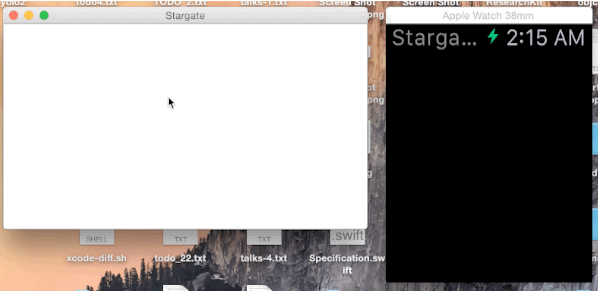

# Stargate

[](http://cocoadocs.org/docsets/Stargate)
[](http://cocoadocs.org/docsets/Stargate)
[](http://cocoadocs.org/docsets/Stargate)
[](https://circleci.com/gh/contentful-labs/Stargate)
<!-- [](https://coveralls.io/r/contentful-labs/Stargate?branch=master) -->



A communication channel from your Mac to your watch.

Providing a convenient wrapper around [MMWormhole][1] and [PeerKit][2],
Stargate leverages Multipeer Connectivity and App Groups to communicate between an
OS X application and ᴡᴀᴛᴄʜ via your iPhone. The communication is bi-directional and
lets you send any object that complies with `NSCoding`.

## Usage

Simply install it via [CocoaPods][4]:

```ruby
use_frameworks!

pod 'Stargate'
```

Note: make sure you use version [0.37][5] or newer. Stargate is written in Swift 1.2,
so it requires Xcode 6.3 or newer as well.

### On the Mac

Send and receive messages via Multipeer Connectivity:

```swift
let stargate = Earth(applicationGroupIdentifier: "group.com.contentful.Stargate")

stargate.listenForMessage(identifier: "stargate2") { (object) -> Void in
	println("Received message on Mac: \(object)")
}

stargate.passMessage("YOLO", identifier: "stargate")
```

### On the phone

Bridge messages between Multipeer and Darwin notifications:

```swift
let stargate = Abydos(applicationGroupIdentifier: "group.com.contentful.Stargate")
    
stargate.tunnel()
stargate.tunnelReplies(identifier: "stargate2")
```

### On the watch

Send and receive messages via Darwin notifications:

```swift
let stargate = Atlantis(applicationGroupIdentifier: "group.com.contentful.Stargate")

stargate.passMessage("YOLO", identifier:"stargate2")

stargate.listenForMessage(identifier:"stargate") { (object) -> Void in
	println("Received message on watch: \(object)")
}

stargate.stopListeningForMessage(identifier:"stargate")
```

Look at the [example project](Example/) for guidance on how to set up one project for all three platforms. When creating the targets, make sure you don't accidentially select the [OS X target][6] as host for the
WatchKit extension.

## License

Copyright (c) 2015 Contentful GmbH. See [LICENSE](LICENSE) for further details.


[1]: https://github.com/mutualmobile/MMWormhole
[2]: https://github.com/jpsim/PeerKit
[4]: http://cocoapods.org
[5]: http://blog.cocoapods.org/CocoaPods-0.37/
[6]: http://openradar.appspot.com/radar?id=4975391517179904
